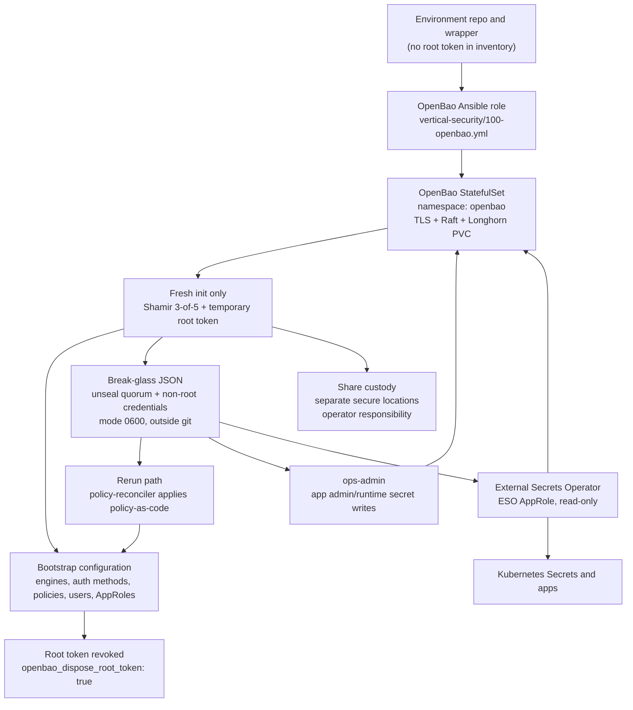

# OpenBao Bootstrap And Security Model

## Executive Summary

OpenBao is the lab's secrets control plane. The bootstrap process creates it as
an internal Kubernetes service, initializes it with Shamir key shares, configures
auth methods, policies, and automation identities, then revokes the initial root
token. After the first bootstrap, normal playbook reruns should not need root.

The security model is based on separation of duties:

- The root token is a first-bootstrap instrument only. It is not a durable
  environment value and should not be committed, copied into inventory, or used
  for routine operations.
- `policy-reconciler` can reapply ACL policy-as-code on reruns, but cannot read
  application secrets or create AppRoles.
- `ops-admin` can read and write the application admin/runtime paths needed by
  the platform, but cannot rewrite ACL policies or create AppRoles.
- `approle-reconciler` can create and manage `object-storage-*` AppRoles and
  their ESO binding records, but cannot write ACL policies or read application
  secret data. Bootstrap-only identity (ADR-0021).
- ESO uses an AppRole with read-only access to the selected secret paths it must
  materialize into Kubernetes Secrets.
- Break-glass access is preserved by protecting the OpenBao data volume, a
  quorum of Shamir key shares, and the local break-glass automation JSON.

This means a secure bootstrap does not preserve power by keeping root around.
It preserves power by keeping recoverability around: the encrypted OpenBao state,
enough unseal/recovery material, and narrowly scoped operational credentials.

## Process Diagram



## Bootstrap Flow

1. The environment wrapper exports runtime variables and runs
   `vertical-security/100-openbao.yml` against the target cluster. The generic
   repo keeps using variables such as `openbao_key_path`, but it must not contain
   real secrets or environment-specific addresses.

2. The role deploys OpenBao in the `openbao` namespace as an internal service on
   port `8200`, using TLS, Raft storage, and the configured Kubernetes storage
   class. The default storage class is Longhorn.

3. The role reads the existing break-glass JSON from
   `{{ openbao_key_path }}.json`, if it exists. This is the rerun state file. It
   contains unseal keys and non-root automation credentials, not a root token.

4. The role checks whether OpenBao is already initialized:

   - If not initialized, it performs a Shamir init with the configured share
     count and threshold. The current default is `3-of-5`.
   - If already initialized, it loads the unseal material and operational
     credentials from the existing break-glass JSON.

5. On a fresh init, the temporary root token is used only long enough to:

   - unseal OpenBao;
   - enable required engines such as AppRole, Kubernetes auth, userpass, PKI, and
     KV v2;
   - write the ACL policies;
   - create the ESO and born-inventory AppRoles;
   - create `ops-admin`;
   - create `policy-reconciler`;
   - create `approle-reconciler`;
   - write the break-glass JSON.

6. On a rerun, the role logs in as `policy-reconciler` and uses that token to
   reapply ACL policies. This allows policy drift to be repaired without keeping
   or reintroducing the root token.

7. The role logs in as `ops-admin` and verifies that it has the required
   capabilities on representative application paths, including the Zot admin
   path. This catches policy drift before later playbooks depend on those paths.

8. If `openbao_dispose_root_token` is true, the initial root token is revoked at
   the end of a fresh bootstrap. This is the intended steady state.

## Initial Bootstrap Preconditions

Before a brand-new bootstrap, confirm these are true:

- The environment wrapper can reach the target control node and kubeconfig.
- Longhorn or the selected storage class is ready before OpenBao needs its PVC.
- TLS/certificate prerequisites are available for the OpenBao internal service.
- `openbao_key_path` points to a secure writable location outside git.
- Any configured custody targets for Shamir shares are mounted and writable.
- The operator has a deliberate backup/custody plan before `bao operator init`
  runs.

Do not bypass share-custody prechecks by writing recovery material into the
repository, into chat transcripts, or into ad hoc temporary locations. If a
custody target is unavailable, stop and fix custody first.

## Why This Bootstrap Is Secure

The bootstrap is secure because it removes standing root access while preserving
recoverability:

- The only full-power credential, the root token, exists only during first
  bootstrap and is revoked afterward.
- Policy repair has its own identity, `policy-reconciler`, scoped to ACL policy
  management rather than secret reads.
- Application secret management has a separate identity, `ops-admin`, scoped to
  the app admin/runtime paths needed by the platform.
- ESO receives only read access to the selected secret paths it must materialize
  into Kubernetes.
- Sensitive OpenBao CLI calls pass credentials into the pod through stdin, with
  Ansible `no_log: true`, instead of exposing them as process arguments.
- OpenBao is served internally with TLS and backed by persistent storage.
- Recovery depends on share quorum and controlled break-glass custody, not on a
  durable root token.
- Generic playbooks remain secret-free; environment-specific values stay in the
  private environment repo or protected local custody locations.

## Security Model

### Root Token

The root token is the most powerful credential OpenBao creates. In this design,
it is treated as disposable bootstrap material:

- It is generated only by `bao operator init`.
- It is used only during first initialization.
- It is not saved into the environment repository.
- It is not required for normal reruns.
- It is revoked once bootstrap has completed.

Do not add an initial or root token to inventory, env files, group vars, CI
variables, or long-lived shell profiles. That would weaken the design by turning
a one-time bootstrap credential into a standing administrative credential.

### Shamir Shares

OpenBao is initialized with Shamir key shares. The default model is `3-of-5`:
five shares exist, and any three can unseal the system or participate in
privileged recovery ceremonies.

These shares are the durable root of recovery. The operator must keep at least a
threshold quorum readable, protected, and separated. Losing quorum means losing
the practical ability to regain privileged access if the normal automation
identities are broken.

### Break-Glass JSON

The file at `{{ openbao_key_path }}.json` is the automation break-glass file. It
is written with mode `0600` and must live outside git. It contains data needed
for unattended or semi-attended operations, including:

- unseal key material used by automation;
- ESO AppRole `role_id` and `secret_id`;
- born-inventory AppRole credentials;
- `ops-admin` username and password;
- `policy-reconciler` username and password;
- Shamir threshold metadata.

It intentionally does not preserve the root token. Treat this file as highly
sensitive. A copy of it can usually restore operational automation, but it
should still be protected like a privileged secret bundle.

### Policy-Reconciler

`policy-reconciler` is a userpass identity with the `policy-writer` policy. Its
job is narrow: reapply policy-as-code on initialized clusters. The policy grants
access to `sys/policies/acl/*`, allowing it to create, read, update, delete, and
list ACL policies.

It should not be used for application secret reads or writes. If this password
is lost on an already initialized cluster, policy repair cannot proceed through
the normal rerun path; use a privileged recovery procedure or rebuild.

### Ops-Admin

`ops-admin` is the operational identity used by app bootstrap and integration
roles. It receives the app admin/runtime writer policies. It can manage paths
such as:

- `secret/data/apps/+/admin`
- `secret/metadata/apps/+/admin`
- `secret/data/apps/+/runtime`
- `secret/metadata/apps/+/runtime`
- selected bootstrap paths such as Authentik passkey material

`ops-admin` should not have broad ACL policy-write privileges. That separation
is deliberate: an app-secret operator should not also be able to rewrite the
rules governing every other identity.

### AppRole-Reconciler

`approle-reconciler` is a bootstrap-only identity with the
`approle-reconciler-writer` policy. Its scope is limited to the
`object-storage-*` AppRoles and their `secret/platform/eso-bindings/object-storage-*`
records (ADR-0021). It can:

- create, read, update, and delete `object-storage-*` AppRole definitions;
- read role-id values;
- create and read secret-id values;
- create, read, update, and delete ESO binding records.

It **cannot**:

- write ACL policies (`sys/policies/acl/*` — reserved for `policy-reconciler`);
- read application secret data (`secret/data/apps/*` — reserved for `ops-admin`);
- create AppRoles outside the `object-storage-*` prefix.

The password is generated during fresh init and persisted to the break-glass
JSON. On existing clusters without the `approle_reconciler_password` field,
the OpenBao role fails early with a clear recovery message — the operator must
run a Shamir-backed privileged recovery ceremony or rebuild.

### ESO AppRole

External Secrets Operator authenticates to OpenBao through the ESO AppRole. The
AppRole receives the `eso-reader` policy and should be read-only for the
application secret paths that ESO materializes into Kubernetes Secrets.

ESO's `secret_id` has a configured TTL, currently defaulting to `720h`. Rotation
should be handled by the ESO rotation playbook, not by manually editing
Kubernetes Secrets unless performing a documented recovery.

### KV V2 Paths

OpenBao KV v2 has separate paths for values and metadata:

- `secret/data/...` is used for reading and writing secret values.
- `secret/metadata/...` is used for listing and metadata operations.

Policies must include both where workflows need both secret access and list or
metadata access. Missing metadata capability can break otherwise valid
automation.

### Credential Handling In Playbooks

Credential-bearing `kubectl exec` calls must pass secrets into the pod through
stdin and local task environment variables with `no_log: true`. They must not
place tokens or passwords in shell command arguments where they can appear in
process listings, audit logs, or Kubernetes request URIs.

This matters because the OpenBao CLI runs inside the pod. Setting `BAO_TOKEN` in
the local Ansible process is not enough unless the command explicitly passes it
into the in-pod shell.

## Vital Components

The following components are vital to preserve the security and recoverability
of the system:

| Component | Why it matters | Operator responsibility |
| --- | --- | --- |
| OpenBao StatefulSet and PVC | Holds the encrypted OpenBao state | Keep storage healthy and backed up |
| TLS secret | Protects OpenBao service traffic | Keep certificate automation working |
| Shamir share quorum | Enables unseal and privileged recovery | Preserve at least threshold shares |
| Break-glass JSON | Preserves non-root automation recovery | Keep outside git, mode `0600`, securely backed up |
| `policy-reconciler` | Repairs policy drift after root revocation | Preserve password and verify rerun works |
| `ops-admin` | Performs app secret bootstrap and runtime writes | Preserve password and rotate deliberately |
| `approle-reconciler` | Creates/manages object-storage AppRoles + ESO bindings | Preserve password; first run requires Shamir recovery on existing clusters |
| ESO AppRole | Lets ESO read approved secret paths | Rotate secret IDs and keep policies narrow |
| ACL policies | Enforce separation of duties | Manage through playbooks, not manual edits |
| Kubeconfig/control-node access | Needed to reach OpenBao pod and cluster resources | Preserve cluster admin access separately |

## What The Operator Must Preserve

To preserve ultimate access when required, the operator must take care of these
items:

1. Keep at least the Shamir threshold available. With the current default, that
   means at least three valid shares. Store shares in separate secure locations
   and periodically confirm they are readable.

2. Keep the break-glass JSON available and protected. It is not root, but it is
   powerful. It should be backed up to secure storage, excluded from git, and
   readable only by the operator account that runs the environment wrapper.

3. Keep OpenBao storage recoverable. A quorum of Shamir shares cannot recover
   secrets if the OpenBao data volume is destroyed and no usable backup exists.

4. Do not persist a root token. If a procedure appears to require a long-lived
   root token, treat that as a design exception and document the recovery
   ceremony instead.

5. Verify rerun idempotency after bootstrap. Running the OpenBao playbook twice
   should succeed: the first run proves fresh bootstrap, and the second run
   proves the non-root policy reconciliation path.

6. Rotate operational credentials deliberately. ESO AppRole secret IDs and
   `ops-admin` credentials have dedicated rotation paths. Rotation should update
   OpenBao and the break-glass file together.

7. Keep inventory clean. Environment inventory may point to the secure
   break-glass location, but it must not contain live root tokens, unseal shares,
   passwords, AppRole secret IDs, or real service credentials.

## Recovery Scenarios

| Scenario | Expected response |
| --- | --- |
| OpenBao pod restarts and is sealed | Unseal using automation or a Shamir quorum, then rerun the OpenBao playbook |
| ACL policy drift breaks app roles | Rerun `vertical-security/100-openbao.yml`; `policy-reconciler` should reapply policies |
| `ops-admin` password is lost | Use a privileged recovery procedure to reset it, or rebuild if recovery material is unavailable |
| `policy-reconciler` password is lost | Use a privileged recovery procedure to restore policy-write access, or rebuild |
| `approle-reconciler` password is lost | Use a privileged recovery procedure to create the userpass user and update break-glass JSON, or rebuild. Object-storage AppRole reconciliation will fail until resolved. |
| ESO cannot read secrets | Check ESO AppRole Secret, TTL/rotation state, `eso-reader` policy, and ClusterSecretStore status |
| Break-glass JSON is lost but Shamir quorum remains | Use a documented privileged recovery ceremony to recreate operational identities |
| Shamir quorum is lost | Ultimate access is not preserved; restore from separate backup or rebuild and reseed secrets |
| OpenBao PVC/data is lost | Restore OpenBao storage from backup, or rebuild and reseed all secrets |

## Normal Validation

After a fresh bootstrap, validate the model with a fresh run and a rerun:

```bash
cd ../dmf-env
bin/run-playbook.sh <env-name> ../dmf-infra/k3s-lab-bootstrap/playbooks/vertical-security/100-openbao.yml
bin/run-playbook.sh <env-name> ../dmf-infra/k3s-lab-bootstrap/playbooks/vertical-security/100-openbao.yml
bin/run-playbook.sh <env-name> ../dmf-infra/k3s-lab-bootstrap/playbooks/runbooks/eso-openbao-health-check.yml
```

The first OpenBao run should complete the bootstrap. The second run should
complete without the root token by using `policy-reconciler`. The health check
should confirm ESO/OpenBao connectivity and representative capabilities.

## Secure Steady State

The desired steady state is:

- OpenBao is initialized, unsealed, TLS-protected, and backed by persistent
  storage.
- The root token has been revoked.
- Policies are managed by playbook reruns through `policy-reconciler`.
- Application secret operations use `ops-admin`.
- ESO reads only the paths it needs.
- Break-glass material is preserved outside git and under operator control.
- At least a Shamir threshold is safely recoverable.

If all of those are true, the bootstrap is secure in the intended sense: normal
automation has only the permissions it needs, the most dangerous token is gone,
and the operator still has a controlled path to regain access when required.
